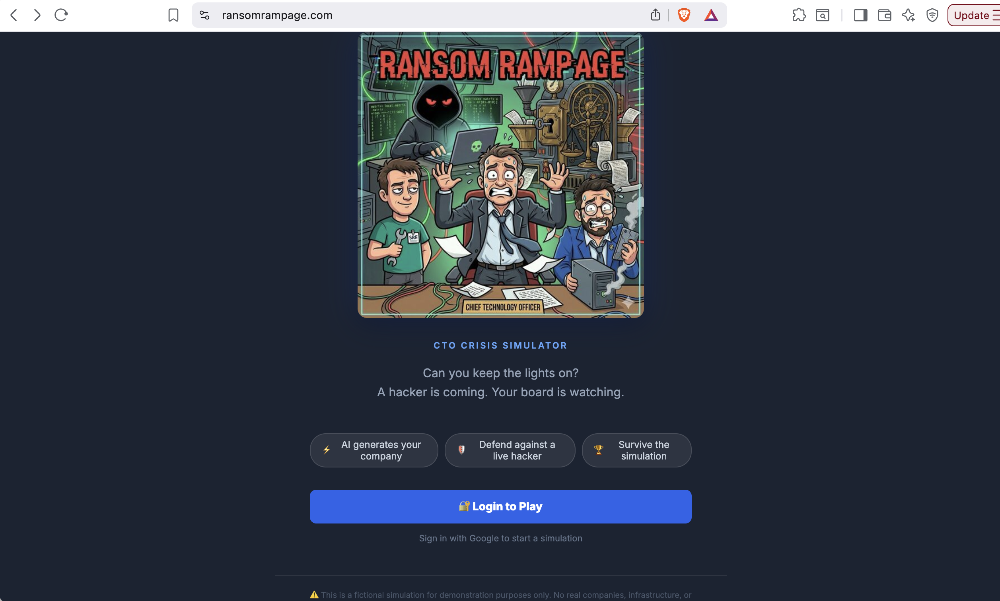
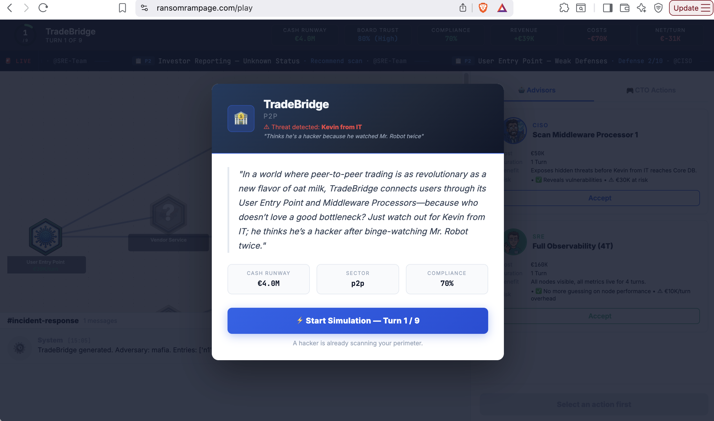
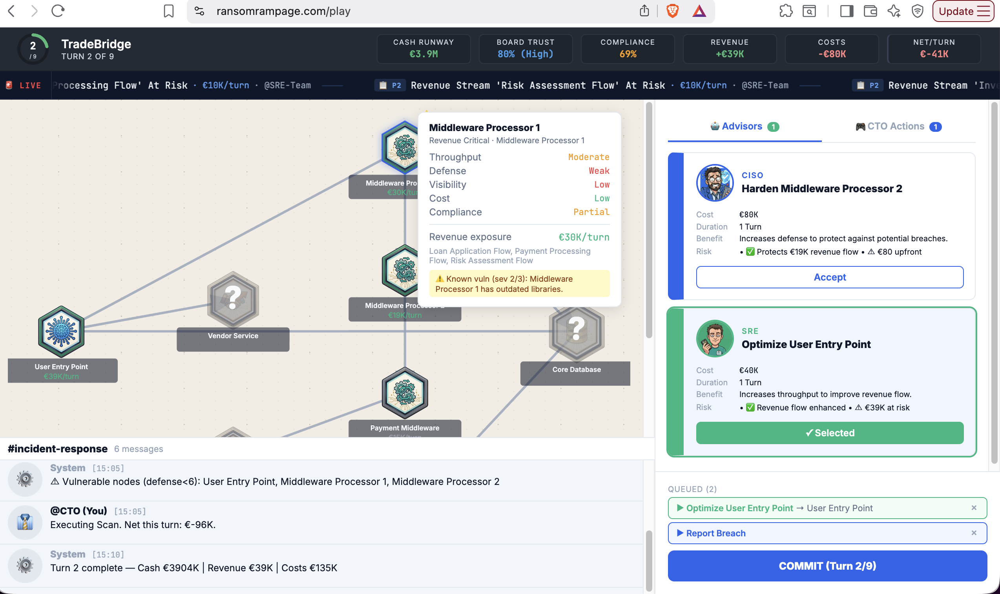
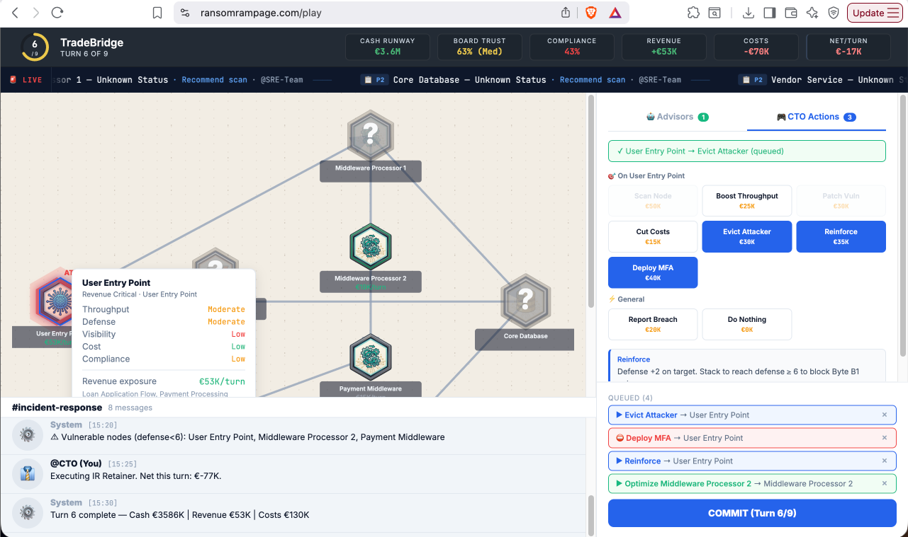
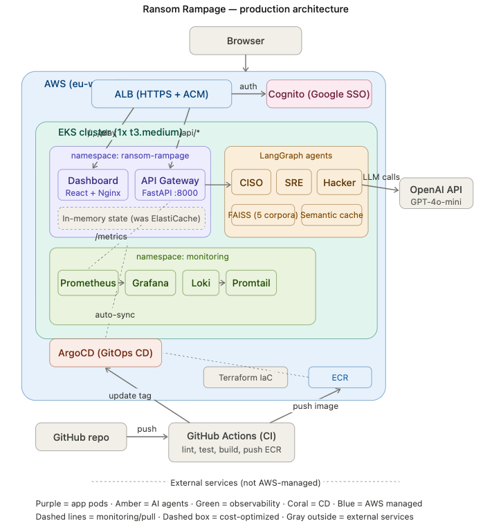
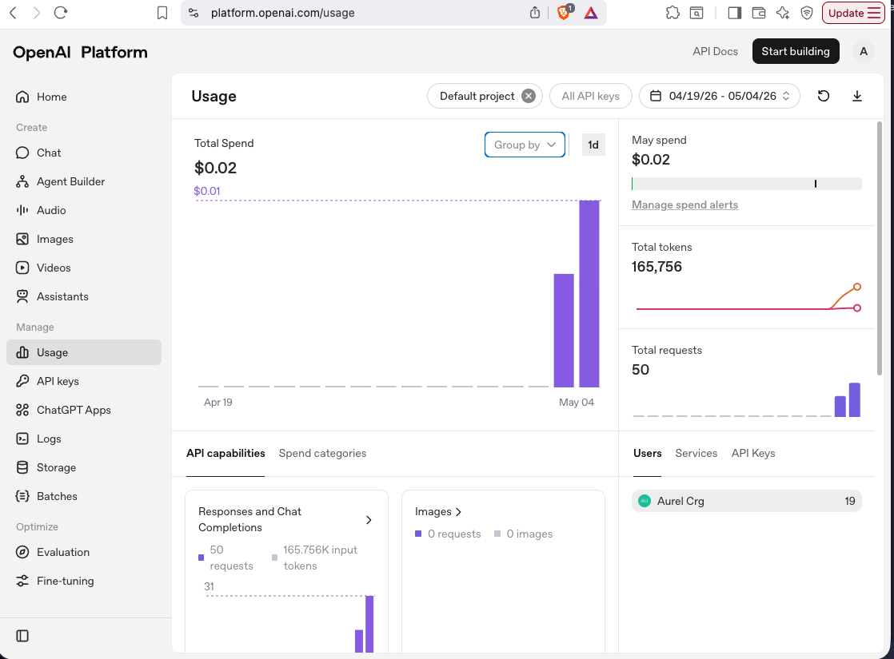
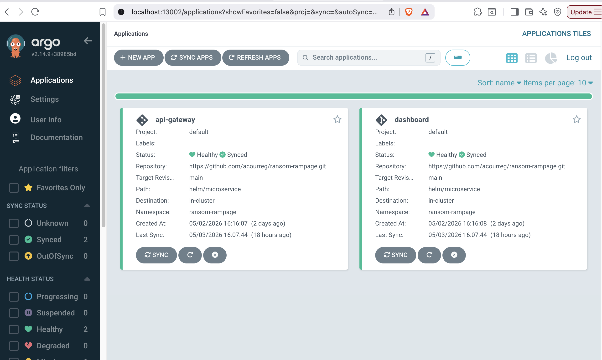
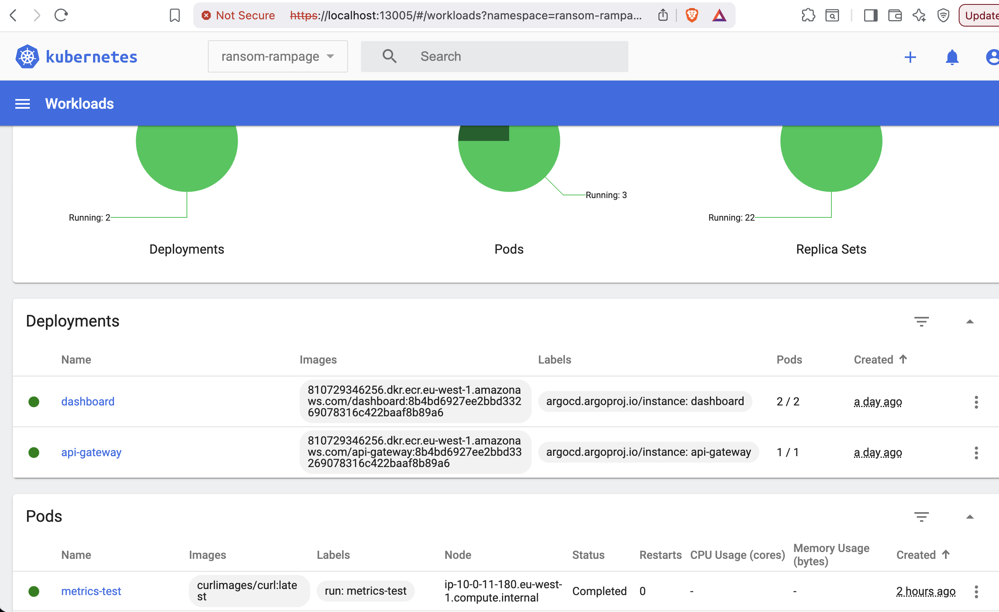
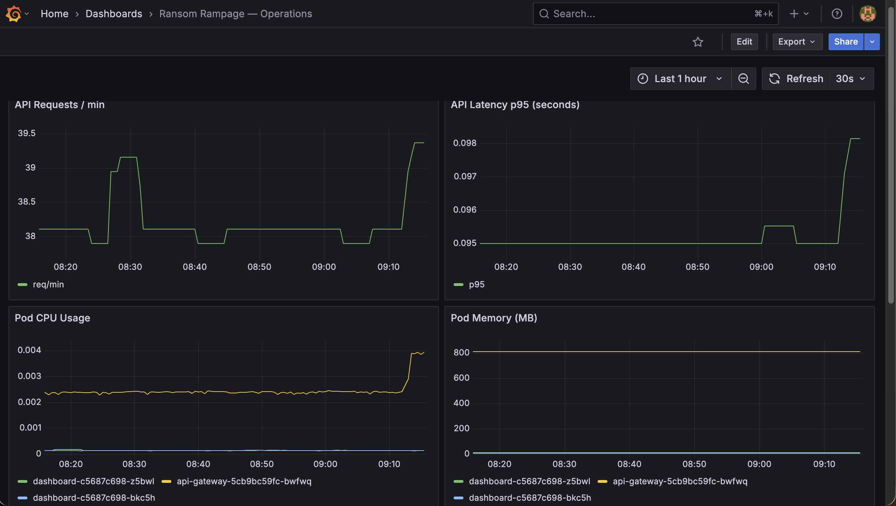
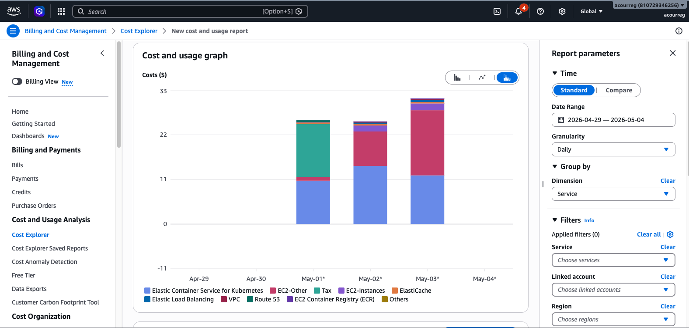

# 🎮 Ransom Rampage — CTO Crisis Simulator

> **Can you keep the lights on?** A hacker is coming. Your board is watching.

AI-powered cybersecurity simulation where you defend a fintech startup against a live AI-driven attacker. Balance security, infrastructure resilience, and business survival across 9 turns — with 3 autonomous AI advisors, a deterministic game engine, and real CTO trade-offs.

**🔗 [Play Live](https://ransomrampage.com)** · **📂 [Source Code](https://github.com/acourreg/ransom-rampage)**



---

## Why This Exists

A complete system — from multi-agent AI to production Kubernetes — built to solve a real architecture problem end-to-end.

| If you're a... | This shows you... |
|---|---|
| **CTO / VP Engineering** | Multi-agent AI — 3 LangGraph agents, $0.02 per game |
| **Hiring Manager** | "Full stack: agents → API → React → EKS → CI/CD → Grafana" |
| **Security / Compliance Lead** | DORA/GDPR mechanics encoded in game rules + agent knowledge bases |
| **Platform / SRE Lead** | Terraform IaC, Helm charts, ArgoCD GitOps, Prometheus + Loki stack |

---

## How It Works



1. **Describe any fintech startup** — AI generates a complete company: infrastructure graph (4–12 nodes), revenue streams, vulnerabilities, and one of 20 named adversary personas (like "Kevin from IT" who *thinks he's a hacker because he watched Mr. Robot twice*).

2. **Receive AI advisor recommendations** — CISO recommends security hardening, SRE suggests infrastructure optimization. Accept their advice or override with your own CTO judgment.



3. **Queue actions, commit your turn** — 21 possible actions across security, infrastructure, and business. Each costs cash, takes time, and has trade-offs. The hacker moves simultaneously.



4. **Survive** — keep cash runway positive, compliance above threshold, board trust above critical, and contain the breach before the regulator shuts you down.

---

## Architecture



### Multi-Agent System (LangGraph)

Three specialized AI agents operate independently each turn, each with RAG-powered domain knowledge:

| Agent | Role | Knowledge Base | Actions |
|---|---|---|---|
| **CISO** | Threat assessment, defense planning | MITRE ATT&CK corpus (~80 chunks) | Scan, patch, reinforce, deploy MFA |
| **SRE** | Infrastructure optimization, recovery | SRE patterns corpus (~60 chunks) | Boost throughput, cut costs, observability |
| **Hacker** | Offensive operations, lateral movement | Offensive techniques corpus (~60 chunks) | Compromise, exfiltrate, lock, fog |

Each agent follows a `gateway → cache_check → retrieve → generate → update_cache` pipeline:

<!-- PLACEHOLDER: agent pipeline diagram -->
<!-- docs/screenshots/agent_graph.png -->

**Semantic caching** (cosine similarity > 0.9999) eliminates redundant LLM calls. In practice, cache hit rates exceed 60% after the first few turns, reducing per-game LLM cost to **$0.02** (50 requests, 165K tokens).



### Entity Generation Pipeline

Scenarios are generated via a 3-node LangGraph pipeline:

- **Venture Architect** — company profile, sector, adversary persona (RAG on fintech archetypes + 25 fictional technologies)
- **SRE Infra** — 4–12 node infrastructure graph across 7 types: entry, server, database, middleware, human, vendor, backup
- **Assembler** — wires 3–4 revenue flows, injects 3–5 vulnerabilities, applies fog-of-war (30–50% nodes hidden), validates all GDD constraints

### Game Engine

- Deterministic engine — no randomness. Outcomes follow from infrastructure state.
- **Resolution order**: `tick → player → byte (hacker) → regulator → recalculate`
- **Revenue model**: `base_revenue × min(throughput) / 10` across node paths
- **21 player actions**: CTO strategic (C1–C9), Security (S1–S6), SRE infrastructure (E1–E6)
- **Win/lose**: cash ≤ 0, compliance < 20%, board trust < 10%, breach timer expired

---

## Tech Stack (17 technologies)

| Layer | Technologies |
|---|---|
| **AI / RAG** | LangGraph · LangChain · OpenAI GPT-4o-mini · FAISS (5 corpora, BGE-small embeddings) |
| **Backend** | FastAPI · Redis · Pydantic · slowapi (rate limiting) |
| **Frontend** | React · Vite · Nginx |
| **Infrastructure** | Terraform · AWS EKS · Helm · ArgoCD (GitOps) |
| **Auth** | AWS Cognito (Google SSO) · ALB-level authentication |
| **CI/CD** | GitHub Actions (lint → test → build → push ECR → update ArgoCD tag) |
| **Observability** | Prometheus · Grafana · Loki · Promtail |

---

## Infrastructure & Deployment

### CI/CD Pipeline

```
git push → GitHub Actions → ruff lint → pytest → Docker build → push ECR → update image tag
                                                                                  ↓
                                                              ArgoCD detects change → auto-sync → EKS
```



### Kubernetes Cluster



| Component | Configuration |
|---|---|
| **EKS** | 1× t3.medium node, eu-west-1 |
| **Networking** | VPC with 2 public + 2 private subnets, NAT Gateway, VPC Endpoints (S3, ECR, STS) |
| **Ingress** | ALB Controller, 2 IngressGroups: public (/, /health) + protected (/play, /api) |
| **Secrets** | External Secrets Operator → AWS SSM Parameter Store |
| **Auth** | Cognito User Pool + Google Identity Provider, ALB-level auth on protected paths |

### Observability



- **Prometheus** scrapes FastAPI `/metrics` — request rate, latency p95, custom LLM duration + cache hit rate
- **Loki + Promtail** aggregates logs from all pods — label-based indexing, LogQL queries
- **Grafana** unified dashboard: 8 panels (API req/min, latency p95, pod CPU/memory, HTTP status codes, active pods, container restarts, application logs)

### Cost

| Scenario | Monthly Cost |
|---|---|
| **Always-on** (1 node, no ElastiCache) | ~$160/mo |
| **Demo-only** (spin up for interviews, destroy after) | ~$5–8 per demo day |
| **Idle** (terraform destroy, keep DNS + state) | $0.50/mo |
| **LLM cost per full game** (50 requests, 165K tokens) | $0.02 |



---

## Run Locally

### Prerequisites

- Docker + Docker Compose
- OpenAI API key

### Quick Start

```bash
git clone https://github.com/acourreg/ransom-rampage.git
cd ransom-rampage

# Configure
cp services/api-gateway/.env.example services/api-gateway/.env
# Edit .env → add your OPENAI_API_KEY

# Run
docker-compose up --build
```

- **Frontend**: http://localhost:5173
- **API Health**: http://localhost:8000/health

### Deploy to AWS (EKS)

```bash
# First-time setup (S3 bucket, SSM secrets, terraform init)
make setup

# Create infrastructure (~15 min)
cd terraform && terraform apply

# Deploy K8s manifests + ArgoCD apps
make deploy

# Access admin dashboards
make port-forward

# Check status
make status

# Tear down (stops billing)
make teardown
```

| Admin UI | URL | Credentials |
|---|---|---|
| Grafana | http://localhost:13001 | admin / prom-operator |
| ArgoCD | https://localhost:13002 | admin / `make argocd-password` |
| Prometheus | http://localhost:13003 | — |

---

## Project Timeline

| Date | Milestone |
|---|---|
| Feb 26 | Vector DBs & Knowledge Bases (5 FAISS corpora) |
| Feb 28 | Multi-Agent Framework (CISO / SRE / Hacker + semantic cache) |
| Mar 11 | Entity Generation Pipeline (3-stage LangGraph) |
| Mar 13 | Resolution Engine (deterministic, 21 actions) |
| Mar 19 | FastAPI Backend + Redis |
| Mar 26 | React Frontend + Game Balance (23 fixes from playtesting) |
| Apr 16 | Terraform IaC (VPC, EKS, ECR, SSM, IRSA, Helm) |
| Apr 30 | Cognito SSO + CI/CD (GitHub Actions + ArgoCD) |
| May 1 | Observability (Prometheus + Grafana + Loki) |
| **May 3** | **ransomrampage.com — GO LIVE** 🎉 |

---

## Key Technical Decisions

| Decision | Chose | Over | Why |
|---|---|---|---|
| Agent framework | LangGraph | CrewAI, AutoGen | Explicit state machine, deterministic control flow |
| Vector DB | FAISS | Pinecone, Chroma | Local, zero-cost, 5 separate corpora with metadata filtering |
| Embeddings | BGE-small | BGE-M3, OpenAI ada | 10× smaller model, sufficient for domain-specific retrieval |
| Game engine | Deterministic Python | LLM-driven outcomes | Reproducible, testable, no hallucination risk in game logic |
| CD | ArgoCD (GitOps) | kubectl in CI | Auto-sync, drift detection, 1-click rollback |
| Logging | Loki | ELK | 256Mi vs 2GB RAM — fits on t3.medium nodes |
| Auth | Cognito + ALB | Custom OAuth middleware | Zero auth code, requests blocked at infra level before reaching pods |

---

## Repository Structure

```
ransom-rampage/
├── services/
│   ├── api-gateway/          # FastAPI backend
│   │   ├── app/
│   │   │   ├── core/         # agents.py, engine.py, generation.py
│   │   │   ├── models/       # Pydantic schemas
│   │   │   ├── routes/       # REST endpoints
│   │   │   ├── services/     # game_service.py
│   │   │   └── storage/      # redis_store.py, vector_store.py
│   │   └── data/             # FAISS indices (5 corpora)
│   └── dashboard/            # React + Vite frontend
│       └── src/components/   # InfraGraph, StrategyPanel, WarRoom, Header
├── terraform/                # AWS infrastructure (EKS, VPC, Cognito, etc.)
│   └── modules/              # networking, eks, ecr, cognito, config
├── helm/microservice/        # Reusable Helm chart (deployment + service)
├── k8s/                      # K8s manifests (ingress, secrets, argocd, monitoring)
├── scripts/                  # setup.sh, deploy.sh, port-forward.sh, teardown.sh
├── .github/workflows/        # CI pipeline (ci.yml)
└── docs/screenshots/         # README images
```

---

## Disclaimer

⚠️ This is a fictional simulation for demonstration purposes only. No real companies, infrastructure, or financial data are represented. No personal data is stored beyond your Google login session. Provided "as is" with no warranty — the author reserves the right to modify or discontinue this service at any time.

---

## Author

**Aurélien Courreges-Clercq** — [scalefine.ai](https://scalefine.ai) · [LinkedIn](https://linkedin.com/in/music2music) · [GitHub](https://github.com/acourreg)

Freelance Data Platform Architect — Streaming (Kafka/Flink) · GenAI/RAG · Backend Modernization

*High-impact architecture for systems that can't afford to fail.*