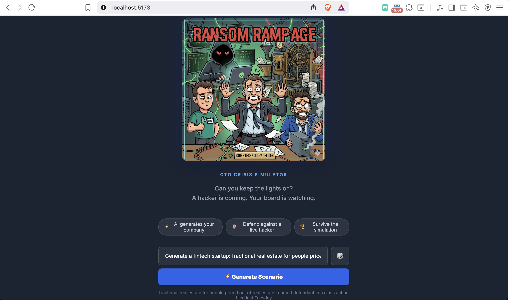
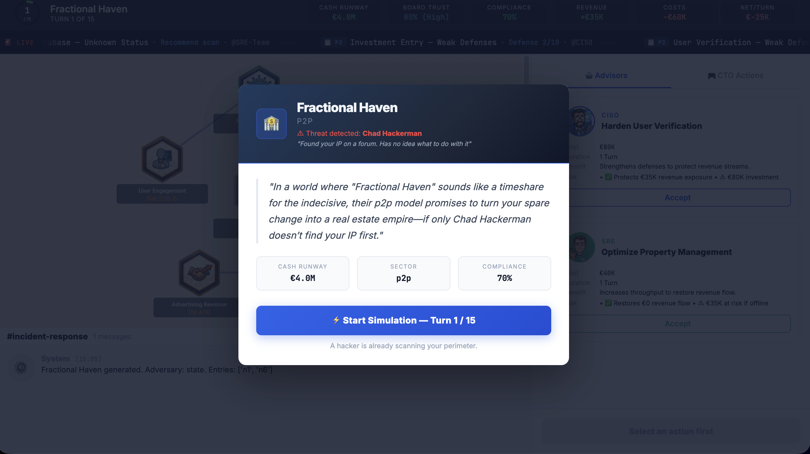
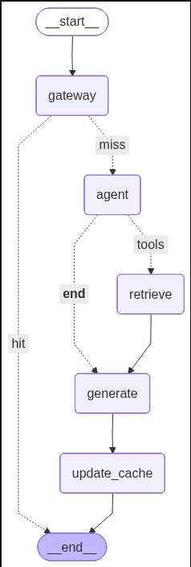
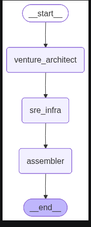
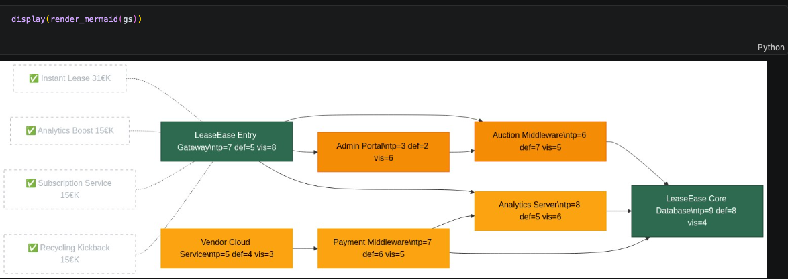
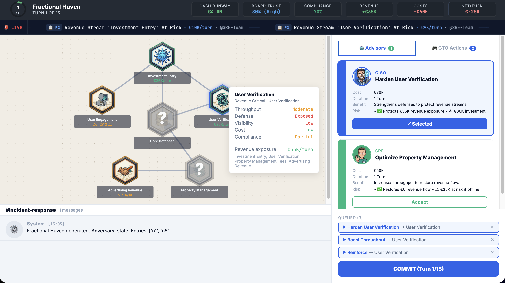

# 🎮 Ransom Rampage — CTO Crisis Simulator

> Can you keep the lights on? A hacker is coming. Your board is watching.

AI-powered cybersecurity simulation where you defend a fintech startup against a live ransomware attack. Every architectural decision has mechanical consequences on revenue, compliance, and survival.



## How It Works

1. **Generate a scenario** — describe any fintech startup. AI creates a complete company: infrastructure graph, revenue streams, vulnerabilities, and an adversary.
2. **Defend against a live hacker** — an AI-driven attacker (powered by a dedicated LangGraph agent) probes your infrastructure each turn.
3. **Survive the simulation** — balance cash runway, board trust, compliance, and revenue across 15 turns while CISO and SRE advisors recommend actions.



## Architecture

### Multi-Agent System (LangGraph)

Three specialized AI agents operate independently each turn, each with RAG-powered domain knowledge:

- **CISO Agent** — threat assessment, defense recommendations (retrieves from MITRE ATT&CK corpus)
- **SRE Agent** — infrastructure optimization, throughput recovery (retrieves from SRE patterns corpus)
- **Hacker Agent** — offensive actions, lateral movement (retrieves from offensive techniques corpus)



Each agent follows a `gateway → agent → retrieve → generate → update_cache` pipeline with semantic caching (cosine > 0.9999) to eliminate redundant LLM calls.

### Entity Generation Pipeline

Scenarios are generated via a 3-node LangGraph pipeline:



- **Venture Architect** — generates company profile, sector, adversary (RAG on fintech archetypes)
- **SRE Infra** — creates 7-node infrastructure graph with typed nodes (RAG on tech corpus)
- **Assembler** — wires revenue flows, vulnerabilities, fog-of-war, validates GDD compliance

### Generated Infrastructure Example



Each node has throughput, defense, visibility, cost, and compliance scores. Revenue flows traverse node paths — if a node goes offline, revenue drops mechanically.

### Gameplay — Advisor Recommendations & Action Queue



The CTO (player) queues actions each turn: harden nodes, boost throughput, scan for threats, patch vulnerabilities, or isolate compromised systems. CISO and SRE advisors provide risk-assessed recommendations with cost/benefit analysis.

## Game Engine

- **100% deterministic** — no RNG. Outcomes derive strictly from infrastructure traits and revenue flows.
- **Resolution engine**: `tick → byte (hacker) → regulator → player → recalculate`
- **Revenue model**: `base_revenue × min(throughput) / 10` across node paths
- **Win/lose conditions**: cash runway, compliance thresholds, board trust, breach timers (per GDD §12)

## Tech Stack

| Layer | Tech |
|-------|------|
| AI Agents | LangGraph · LangChain · OpenAI API · FAISS |
| Backend | FastAPI · Redis · Pydantic |
| Frontend | React · Vite |
| Vector DBs | FAISS (5 domain-specific corpora, BGE-M3 embeddings) |
| Infra | Docker · AWS (planned) |

## Run Locally

```bash
git clone https://github.com/acourreg/ransom-rampage.git
cd ransom-rampage/services/api-gateway
cp .env.example .env  # add your OPENAI_API_KEY
docker-compose up --build
```

Frontend: `http://localhost:5173` · API: `http://localhost:8000/health`

## Status

| Epic | Status |
|------|--------|
| Vector DBs & Knowledge Bases | ✅ Done |
| Multi-Agent Framework (CISO/SRE/Hacker) | ✅ Done |
| Entity Generation Pipeline | ✅ Done |
| Resolution Engine (deterministic) | ✅ Done |
| FastAPI Backend + Redis | ✅ Done |
| React Frontend | ✅ Done |
| AWS Infra & CI/CD | 🔜 Next |

## Author

**Aurélien Courreges-Clercq** — [scalefine.ai](https://scalefine.ai) · [GitHub](https://github.com/acourreg)

Freelance Data Platform Architect · Kafka/Streaming · GenAI/RAG · Backend Modernization